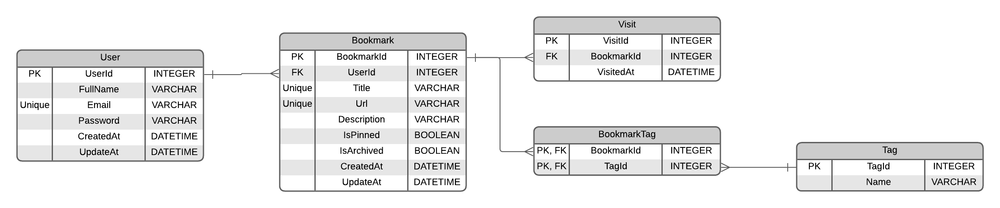

# Application de gestionnaire de favoris


Fully functional bookmark manager with creation, edit, archive, search, and filter features.

Fully functional bookmark manager with creation, edit, archive, search, and filter features.

## Features

Users are able to:

- Add new bookmarks with a title, description, website URL, and tags
- View all their bookmarks
- See bookmark details, including favicon, title, URL, description, tags, view count, last visited date, and date added
- Search for bookmarks by title in the search bar
- Filter bookmarks by selecting one or multiple tags from the sidebar
- Reset tag filters to view all bookmarks again
- View archived bookmarks
- Archive bookmarks to remove them from the main view without deleting them
- Pin/unpin bookmarks to keep important ones easily accessible
- Edit existing bookmarks to update their details
- Copy bookmark URLs to the clipboard
- Visit bookmarked websites directly from the app
- Sort bookmarks by "Recently added," "Recently visited," or "Most visited"
- Toggle between light and dark color themes
- View the optimal layout for the interface depending on their device's screen size

## Database diagram



## Run the application locally

```bash
# Prerequisite: Docker must be installed on your machine
# Download Docker Desktop from: https://www.docker.com/products/docker-desktop/

git clone https://github.com/elsadse/bookmark-manager-app.git
cd bookmark-manager-app
docker compose up
```

After executing these commands and once the Docker containers are started, you can access the application at the following address: **http://localhost/bookmark-manager-app**

## Tech Stack

- **Backend Core:** [Asp.net Core](https://dotnet.microsoft.com/fr-fr/apps/aspnet) 10 with [Entity Framework](https://learn.microsoft.com/fr-fr/aspnet/entity-framework) for database migrations and management.
- **Frontend Core:** [React](https://react.dev/) 19 with [TypeScript](https://www.typescriptlang.org/) for type-safe development.
- **Styling:** [Tailwind CSS](https://tailwindcss.com/) 4.1 for a modern, utility-first UI design.
- **Data Fetching :** [TanStack Query](https://tanstack.com/query/latest)
- **State Management:** [Zustand](https://zustand-demo.pmnd.rs/) for global state management.
- **Data Management:** [Zod](https://zod.dev/) for schema-driven API validation and the native Fetch API for network requests.
- **Build Tooling:** [Vite](https://vitejs.dev/) for an optimized development environment and fast bundling.
- **CI/CD & Infrastructure:** [GitHub Actions](https://github.com/features/actions) for automated Build & Deploy pipelines, hosted on [GitHub Pages](https://pages.github.com/).
- **Containerization:** [Docker](https://www.docker.com/) and [Docker Compose](https://docs.docker.com/compose/) for containerized deployment and simplified local development setup.

## Auteurs

- [@elsadse](https://www.github.com/elsadse)